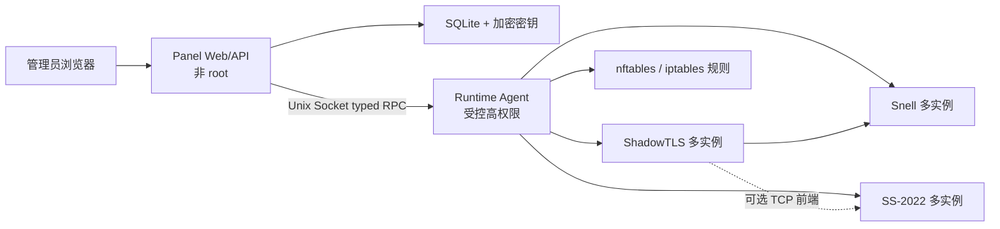

# Proxy Panel 单容器全功能版开发规格书

版本：0.1  
状态：已确认，待开发  
日期：2026-08-16  
目标环境：Debian / Ubuntu Linux VPS，Docker Engine

## 1. 文档目的

本项目基于以下上游项目的功能与配置语义，开发一个单容器运行的网页管理面板：

- Snell 管理脚本：<https://github.com/jinqians/snell.sh>
- 统一菜单：<https://raw.githubusercontent.com/jinqians/snell.sh/main/menu.sh>
- Snell 主脚本：<https://raw.githubusercontent.com/jinqians/snell.sh/main/snell.sh>
- Snell 多用户脚本：<https://raw.githubusercontent.com/jinqians/snell.sh/main/multi-user.sh>
- ShadowTLS 脚本：<https://raw.githubusercontent.com/jinqians/snell.sh/main/shadowtls.sh>
- SS-2022 脚本：<https://github.com/jinqians/ss-2022.sh>
- 中国大陆 IP 屏蔽脚本：<https://raw.githubusercontent.com/jinqians/ss-2022.sh/main/block-mainland.sh>

本文档是产品、架构、接口、安全、测试和验收的统一依据。开发过程中如果实现与本文档冲突，应先更新本文档并记录原因。

## 2. 产品目标

用户在已经安装 Docker 的 Linux VPS 上执行一次安装命令后，应获得一个容器。该容器同时提供：

- 密码保护的中文网页面板。
- Snell v4、v5、v6 节点管理。
- Snell 多用户、多端口和多版本实例。
- Shadowsocks Rust / SS-2022 节点管理。
- SS-2022 多端口实例。
- ShadowTLS v3 多实例，可绑定 Snell 或 SS-2022 后端。
- 节点启停、重启、日志、状态、连接数及流量统计。
- 客户端配置、分享链接和二维码生成。
- 流量限额、暂停、恢复和月度重置。
- SS-2022 中国大陆来源 IP 屏蔽。
- 上游版本检查、分阶段更新、健康检查和自动回滚。
- 配置备份、恢复和操作审计。

用户不需要在宿主机安装 Snell、SS-2022、ShadowTLS 或 systemd 服务。

## 3. 非目标

第一版不包含：

- Windows、macOS、Docker Desktop 正式支持。
- Kubernetes、Docker Swarm 或多主机集群。
- 多管理员、租户、角色权限系统。
- 计费、销售、支付或订阅系统。
- 任意 Shell 终端或网页远程命令执行。
- 自动修改云厂商安全组。
- 将未知版本的远程 Bash 脚本直接以 root 身份执行。
- 承诺 ShadowTLS 为 SS-2022 UDP 流量提供保护。

## 4. 已确认的产品决策

### 4.1 部署模型

- 面板和全部协议服务位于同一个 Docker 容器。
- 容器内允许多个进程，但必须由可靠的 init/进程监督机制管理。
- 不挂载 Docker Socket。
- 完整功能模式使用 Linux host 网络。
- 需要 `NET_ADMIN` 和 `NET_RAW` 能力以支持流量规则和大陆 IP 屏蔽。
- 所有持久化数据位于 `/data`，删除并重建容器不得丢失配置。

### 4.2 登录规则

- 不需要用户名。
- 登录页只有密码输入框。
- 默认管理员密码固定为 `password`。
- 第一次成功登录后必须修改密码。
- 未完成首次改密时，除改密、退出和必要的会话接口外，禁止访问任何其他面板 API。
- 新密码长度为 4–128 个 Unicode 字符。
- 新密码不能为空，且不能继续使用 `password`。
- 不要求大小写、数字、符号或复杂度组合。
- 密码只保存 Argon2id 哈希，不保存明文。
- 修改密码后注销全部旧会话，并要求使用新密码重新登录。
- 提供容器内密码重置命令：`panelctl reset-password password`。

### 4.3 默认网络拓扑

- Snell 默认监听 `0.0.0.0:6160`，同时支持 TCP/UDP；仅作为 ShadowTLS TCP 后端时可手动收敛到回环地址。
- ShadowTLS 默认公开监听 `0.0.0.0:8443/tcp` 并转发到 Snell。
- SS-2022 默认创建一个原生 TCP+UDP 节点。
- SS-2022 的 ShadowTLS 为可选功能，并在界面提示 ShadowTLS 前端主要处理 TCP。
- 面板默认监听 `0.0.0.0:8080`，Docker 部署后可以直接通过服务器 IP 访问。
- 用户可设置 `PANEL_BIND=127.0.0.1`，切换为仅本机、SSH 隧道或 HTTPS 反代访问。

## 5. 技术选型

### 5.1 后端与运行代理

- Go。
- 一个代码仓库、一个 Go module。
- 编译出两个入口或一个带子命令的二进制：
  - `panel server`：Web/API，使用非 root 用户运行。
  - `panel agent`：协议进程、网络规则和运行时管理，保留必需能力。
  - `panelctl`：本地维护命令，可由同一个二进制提供。
- Web 与 Agent 通过 Unix Domain Socket 通信。
- RPC 必须是有类型、白名单化的业务命令，不提供通用 Shell 执行接口。

### 5.2 前端

- Vue 3。
- TypeScript。
- Vite。
- 前端构建产物嵌入 Go 二进制或复制到最终镜像，不在生产镜像中保留 Node.js。
- 中文为默认语言。
- 支持桌面和手机宽度。

### 5.3 数据库

- SQLite。
- 启用 WAL。
- 使用版本化数据库迁移。
- 数据库路径：`/data/db/panel.db`。
- 主密钥：`/data/secrets/master.key`，首次启动生成，权限 `0600`。
- PSK、SS 密钥、ShadowTLS 密码等敏感字段使用主密钥加密后保存。

### 5.4 容器进程监督

- 使用 s6-overlay 或同等级别的轻量 init。
- 至少监督 Web/API 和 Runtime Agent 两个常驻进程。
- Agent 负责启动协议子进程、维护进程组、转发信号和收集退出状态。
- 协议子进程必须在 Agent 退出时一并退出，并在 Agent 恢复后根据数据库期望状态进行协调。
- 正常关闭顺序：先停止 ShadowTLS，再停止后端 Snell/SS，最后关闭 Agent 和 Web。

## 6. 总体架构



安全边界：

- Web 进程不以 root 运行。
- Web 不直接执行协议命令，不直接修改防火墙。
- Agent 仅接受节点、配置、状态、流量和更新等固定 RPC。
- Agent 只能访问 `/data` 中由本项目管理的路径。
- 所有外部字符串都必须经过结构化校验后转为参数数组，禁止拼接 Shell 命令。

## 7. 宿主机与平台要求

正式支持：

- Debian 12 或更新版本。
- Ubuntu 22.04 LTS 或更新版本。
- `linux/amd64`。
- `linux/arm64`。
- Docker Engine 和 Docker Compose 插件。
- cgroup v2 优先。

限制：

- Snell v6 仅在上游提供对应二进制的架构上启用。
- 完整功能依赖 `--network host`，因此不把 Docker Desktop 作为支持目标。
- 宿主机已有 nftables/iptables 规则时必须采用独立链和注释，不能覆盖整套规则。
- 云厂商安全组需要用户自行放行面板和节点端口。

## 8. 单容器运行参数

最终安装器应生成等价于以下配置的单服务 Compose 文件：

```yaml
services:
  proxy-panel:
    image: ${PROXY_PANEL_IMAGE}
    container_name: proxy-panel
    restart: unless-stopped
    network_mode: host
    cap_add:
      - NET_ADMIN
      - NET_RAW
    volumes:
      - /opt/proxy-panel:/data
    environment:
      PANEL_BIND: 0.0.0.0
      PANEL_PORT: "8080"
      TZ: Asia/Shanghai
    healthcheck:
      test: ["CMD", "/usr/local/bin/panel", "healthcheck"]
      interval: 30s
      timeout: 5s
      retries: 3
      start_period: 30s
```

不得使用：

- `--privileged`。
- Docker Socket 挂载。
- 宿主机根目录挂载。
- 宿主机 systemd 目录挂载。

## 9. 持久化目录

```text
/data/
├── db/
│   └── panel.db
├── config/
│   ├── snell/<node-id>.conf
│   ├── ss/<node-id>.json
│   └── shadowtls/<node-id>.json
├── runtime/
│   ├── snell/<version>/<arch>/snell-server
│   ├── shadowsocks-rust/<version>/<arch>/ssserver
│   └── shadowtls/<version>/<arch>/shadow-tls
├── upstream/
│   ├── manifests/
│   ├── scripts/
│   └── checksums/
├── releases/
├── backups/
├── logs/
├── traffic/
└── secrets/
    └── master.key
```

要求：

- 使用固定 UID/GID，避免镜像升级后权限变化。
- 配置和数据库默认 `0600` 或 `0640`。
- 目录默认 `0700` 或 `0750`。
- 日志中禁止输出完整密码、PSK、SS 密钥或 Session Token。
- 备份文件默认加密或至少设置为 `0600`。

## 10. 首次启动流程

1. 检查 `/data` 是否可写。
2. 初始化目录和权限。
3. 生成数据库和主密钥。
4. 创建唯一的认证记录：
   - 默认密码：`password`。
   - `must_change_password=true`。
5. 检测架构和内核能力。
6. 下载或准备 Snell、shadowsocks-rust 和 ShadowTLS 运行时。
7. 校验下载结果并记录来源、版本和 SHA256。
8. 创建默认节点配置。
9. 检查端口冲突；冲突时只为协议节点自动换端口，面板端口冲突应明确报错。
10. 启动 Snell、ShadowTLS、SS-2022。
11. 启动 Web/API。
12. 日志明确提示：
    - 面板地址。
    - 默认密码为 `password`。
    - 首次登录必须改密。
    - 如果监听公网，立即改密并配置 HTTPS。

首次初始化必须幂等。容器重启不能重置密码、密钥、端口或数据库。

## 11. 默认节点配置

### 11.1 Snell 主节点

- ID：`snell-main`。
- 名称：`Snell 主节点`。
- 版本：Snell v5 当前兼容稳定版本。
- 监听：`0.0.0.0:6160/tcp+udp`。
- PSK：16 字节安全随机数的 Base64 表示。
- 默认对公网监听；如果仅作为 ShadowTLS TCP 后端，可手动改为 `127.0.0.1`。
- 期望状态：运行。

### 11.2 ShadowTLS 主节点

- ID：`shadowtls-snell-main`。
- 名称：`Snell ShadowTLS`。
- 版本：ShadowTLS v3 当前兼容稳定版本。
- 监听：`0.0.0.0:8443/tcp`。
- 后端：Snell 节点的 `6160` 端口（ShadowTLS 会将通配公网地址映射到本机回环地址）。
- SNI：`www.microsoft.com`。
- 密码：安全随机生成。
- `wildcard-sni`：关闭。
- Fast Open：开启，系统不支持时降级并告警。
- 期望状态：运行。

### 11.3 SS-2022 主节点

- ID：`ss-main`。
- 名称：`SS-2022 主节点`。
- 监听：`0.0.0.0:<自动选择端口>`。
- 端口范围：10000–65535。
- 模式：TCP + UDP。
- 加密：`2022-blake3-aes-128-gcm`。
- 密钥：16 字节安全随机数的 Base64 表示。
- TFO：开启。
- DNS：使用系统默认 DNS。
- simple-obfs：关闭。
- 期望状态：运行。

### 11.4 SS-2022 ShadowTLS 前端

- ID：`shadowtls-ss-main`。
- 名称：`SS-2022 ShadowTLS`。
- 监听：`0.0.0.0:<自动选择独立 TCP 端口>`。
- 后端：`ss-main` 的本机 TCP 端口。
- SNI、密码、wildcard-sni 与 TFO 要求同 Snell ShadowTLS 前端。
- ShadowTLS 只封装 TCP；UDP 继续使用 `ss-main` 的原始公网 UDP 端口，并在客户端配置中明确提示。
- 期望状态：运行。

## 12. 认证与会话

### 12.1 登录

- 请求体仅包含 `password`。
- 不存在 username 字段。
- 比较过程必须使用安全密码哈希库。
- 登录失败返回统一错误，不区分内部状态。
- 单 IP 登录限制建议：5 次/分钟，连续失败后指数退避。
- 成功登录后创建随机 Session Token。
- Cookie 属性：`HttpOnly`、`SameSite=Strict`；启用 HTTPS 时必须 `Secure`。

### 12.2 首次改密中间态

- 默认密码登录成功后返回受限会话。
- 受限会话仅允许：
  - 查询认证状态。
  - 修改密码。
  - 退出。
- 服务管理、日志、密钥、系统信息和更新 API 全部返回 `403 PASSWORD_CHANGE_REQUIRED`。
- 修改成功后：
  - 更新 Argon2id 哈希。
  - 设置 `must_change_password=false`。
  - 使全部 Session 失效。
  - 写入不含密码的审计记录。

### 12.3 密码修改规则

- 4–128 个 Unicode 字符。
- 不允许空字符串。
- 不允许等于 `password`。
- 不做其他复杂度限制。
- 前后空格属于密码内容，不应静默裁剪；界面应提示用户。

### 12.4 密码重置

```bash
docker exec proxy-panel panelctl reset-password password
```

重置后：

- 密码恢复为 `password`。
- `must_change_password=true`。
- 注销全部 Session。
- 记录本地维护审计事件。

## 13. 核心数据模型

建议至少包含以下表：

### 13.1 `auth_state`

- `id`，固定为 1。
- `password_hash`。
- `must_change_password`。
- `password_changed_at`。
- `created_at`、`updated_at`。

### 13.2 `sessions`

- `id`。
- `token_hash`。
- `restricted`。
- `remote_ip`。
- `user_agent`。
- `expires_at`。
- `created_at`、`last_seen_at`。

### 13.3 `nodes`

- `id`，UUID。
- `type`：`snell`、`ss2022`、`shadowtls`。
- `name`。
- `enabled`。
- `desired_state`。
- `runtime_version`。
- `listen_host`、`listen_port`。
- `backend_node_id`，ShadowTLS 使用。
- `created_at`、`updated_at`。

### 13.4 `node_configs`

- `node_id`。
- `schema_version`。
- `config_json`，非敏感配置。
- `secret_ref`，敏感字段引用。
- `revision`。

### 13.5 `secrets`

- `id`。
- `kind`。
- `ciphertext`。
- `nonce`。
- `created_at`、`updated_at`。

### 13.6 `config_revisions`

- 节点 ID。
- 修订号。
- 脱敏后的配置快照。
- 运行时版本。
- 修改来源。
- 创建时间。

### 13.7 `runtime_instances`

- 节点 ID。
- PID。
- 实际状态。
- 启动时间。
- 退出码。
- 最近错误。
- 重启次数。

### 13.8 `traffic_counters`

- 节点 ID。
- 统计周期。
- 上传、下载和总字节数。
- 月度限额。
- 重置日。
- 暂停状态。
- 最近采样值。

### 13.9 `jobs`

- 类型：配置应用、更新、备份、恢复、流量重置等。
- 状态：pending、running、success、failed、rolled_back。
- 进度、结果和脱敏错误。

### 13.10 `audit_logs`

- 操作类型。
- 目标类型与 ID。
- 来源 IP。
- 脱敏详情。
- 成功/失败。
- 时间。

## 14. Snell 功能规格

面板字段：

- 节点名称。
- 版本：v4、v5、v6。
- 监听地址和端口。
- PSK：自动生成、手动输入、重新生成。
- DNS。
- IPv6。
- TFO，仅在当前版本支持时展示。
- 是否直接公开原始端口。
- 是否启用 ShadowTLS。
- 期望状态。

行为：

- 支持创建多个节点，每个节点独立进程和配置文件。
- 不同节点可使用不同 Snell 版本。
- v6 在不支持的架构上不可选择。
- 使用 ShadowTLS 时，默认把 Snell 后端改为 `127.0.0.1`。
- 删除 Snell 节点前必须先处理依赖它的 ShadowTLS 节点。
- 生成 Surge 配置。
- 展示脱敏 PSK，点击查看时要求再次输入管理员密码。

## 15. SS-2022 功能规格

面板字段：

- 节点名称。
- 监听地址和端口。
- 模式：TCP+UDP、仅 TCP、仅 UDP；默认 TCP+UDP。
- 加密方法。
- 密钥/密码。
- TFO。
- DNS。
- simple-obfs：关闭、HTTP、TLS。
- obfs host。
- 中国大陆来源 IP 屏蔽。
- 期望状态。

至少支持原脚本列出的加密方法，默认突出显示 2022 系列。对 2022 方法必须校验 Base64 解码长度：

- `2022-blake3-aes-128-gcm`：16 字节。
- `2022-blake3-aes-256-gcm`：32 字节。
- `2022-blake3-chacha20-poly1305`：32 字节。
- `2022-blake3-chacha8-poly1305`：32 字节。

行为：

- 支持创建多个独立 SS 节点。
- TCP/UDP 端口冲突分别检查。
- 生成 SIP002 链接、Surge 配置和二维码。
- simple-obfs 安装失败时不得破坏原节点。
- ShadowTLS 绑定 SS 时必须说明：ShadowTLS 前端只作为 TCP 通道设计，UDP 应按原始 SS 端口单独处理。

## 16. ShadowTLS 功能规格

面板字段：

- 节点名称。
- 后端类型和后端节点。
- 监听地址和端口。
- SNI。
- 密码。
- `wildcard-sni`：off、authed；高级模式可支持 all，但必须给出风险提示。
- Fast Open。
- 期望状态。

行为：

- 一个 ShadowTLS 节点绑定一个后端节点。
- 一个后端可有多个 ShadowTLS 前端，但端口必须不同。
- 启动顺序为后端先启动，ShadowTLS 后启动。
- 后端停止时，依赖的 ShadowTLS 标记为 degraded 或一并停止。
- 删除后端前显示依赖关系。
- 生成 Snell + ShadowTLS 或 SS + ShadowTLS 客户端配置。

## 17. 面板页面结构

### 17.1 登录页

- 仅密码输入框。
- 登录按钮。
- 不显示用户名。
- 首次登录使用默认密码提示可显示在安装文档，不应长期显示在登录页。

### 17.2 首次改密页

- 新密码。
- 确认新密码。
- 密码规则简要提示。
- 不提供跳过按钮。

### 17.3 仪表盘

- 宿主机 CPU、内存、磁盘、负载、运行时间。
- 容器版本和启动时间。
- Snell、SS-2022、ShadowTLS 数量及运行状态。
- 每个节点 CPU、内存、连接数、上传、下载、总流量。
- 健康、降级、停止、更新可用等状态。
- 最近错误和最近操作。

### 17.4 节点管理

- Snell 列表和编辑抽屉/页面。
- SS-2022 列表和编辑抽屉/页面。
- ShadowTLS 列表和后端关系。
- 创建、复制、启停、重启、删除。
- 删除和重置密钥属于需要确认的操作。

### 17.5 客户端配置

- 按节点显示。
- 一键复制。
- 二维码。
- Surge、SIP002、Clash Meta 等格式。
- 默认隐藏完整密钥。

### 17.6 流量管理

- 当前周期已用、剩余和限额。
- 月度重置日。
- 手动暂停、恢复和重置。
- 自动暂停状态。
- TCP/UDP 统计范围说明。

### 17.7 更新中心

- 面板版本。
- 上游脚本 commit 和脚本版本。
- Snell、shadowsocks-rust、ShadowTLS 当前与最新版本。
- 兼容性状态。
- 检查、预览、更新和回滚。

### 17.8 日志与审计

- 按节点查看实时日志。
- 支持级别和关键词过滤。
- 敏感信息脱敏。
- 操作审计列表。

### 17.9 系统设置

- 修改密码。
- 面板监听配置提示。
- 公网访问安全提示。
- 备份和恢复。
- 诊断信息导出。

## 18. API 草案

统一前缀：`/api/v1`。

### 18.1 认证

- `POST /auth/login`
- `POST /auth/change-password`
- `POST /auth/logout`
- `GET /auth/session`

### 18.2 仪表盘

- `GET /dashboard`
- `GET /system/metrics`
- `GET /system/health`

### 18.3 节点

- `GET /nodes`
- `POST /nodes`
- `GET /nodes/{id}`
- `PUT /nodes/{id}`
- `DELETE /nodes/{id}`
- `POST /nodes/{id}/validate`
- `POST /nodes/{id}/apply`
- `POST /nodes/{id}/start`
- `POST /nodes/{id}/stop`
- `POST /nodes/{id}/restart`
- `POST /nodes/{id}/rotate-secret`
- `GET /nodes/{id}/client-configs`
- `GET /nodes/{id}/metrics`
- `GET /nodes/{id}/logs`，SSE。

### 18.4 流量

- `GET /traffic`
- `PUT /traffic/{nodeId}/quota`
- `POST /traffic/{nodeId}/pause`
- `POST /traffic/{nodeId}/resume`
- `POST /traffic/{nodeId}/reset`

### 18.5 更新

- `POST /updates/check`
- `GET /updates/status`
- `POST /updates/preview`
- `POST /updates/apply`
- `POST /updates/rollback`

### 18.6 备份

- `POST /backups`
- `GET /backups`
- `POST /backups/{id}/restore`
- `DELETE /backups/{id}`

所有修改类 API：

- 验证 CSRF。
- 检查首次改密状态。
- 产生审计记录。
- 返回任务 ID，长任务异步执行。
- 重复请求必须可安全重试或通过幂等键去重。

## 19. Runtime Agent 规格

Agent 支持的业务操作：

- 获取系统和进程状态。
- 校验端口。
- 校验和写入候选配置。
- 启动、停止、重启协议实例。
- 获取节点日志。
- 读取有限的进程指标。
- 管理本项目专属防火墙链和集合。
- 下载并校验运行时版本。
- 切换运行时版本和回滚。
- 创建和恢复备份。

Agent 禁止提供：

- 任意命令字符串执行。
- 任意路径文件读写。
- 任意进程 PID 操作。
- 任意 iptables/nftables 命令透传。
- 通过 API 下载任意 URL 并执行。

每个节点的实际进程必须由节点 ID 映射到固定的配置路径、日志路径和可执行文件路径。

## 20. 配置应用事务

修改节点时执行：

1. API Schema 校验。
2. 业务规则校验。
3. 端口冲突检查。
4. 后端依赖检查。
5. 生成候选配置到临时目录。
6. 使用对应程序的检查能力验证；无检查参数时使用隔离的短生命周期测试进程。
7. 保存数据库修订和旧配置快照。
8. 原子替换配置文件。
9. 仅重启受影响节点。
10. 检查进程存活、端口监听和最近错误。
11. 成功则提交任务。
12. 失败则恢复旧配置和旧运行时并重启。

不得在验证成功前覆盖最后一个可工作的配置。

## 21. 进程与健康状态

统一状态：

- `starting`
- `running`
- `degraded`
- `stopping`
- `stopped`
- `failed`
- `updating`

健康检查至少包含：

- 进程存在。
- PID 属于当前节点实例。
- 预期 TCP/UDP 端口已监听。
- 最近启动日志没有已知致命错误。
- ShadowTLS 后端可连接。
- 进程没有进入频繁重启循环。

重启退避：1、2、5、10、30、60 秒；超过阈值后标记 failed，等待人工操作。

## 22. 流量统计与限额

### 22.1 规则原则

- 优先使用 nftables；必要时兼容 iptables-nft/iptables-legacy。
- 创建独立表、链或 ipset，不覆盖宿主机现有规则。
- 所有规则带项目和节点 ID 注释。
- Agent 启动时进行幂等协调。
- 删除节点时只删除该节点的规则。
- 提供 `panelctl cleanup-firewall` 清理本项目规则。

### 22.2 统计

- 按节点端口统计入站和出站字节。
- SS-2022 TCP 和 UDP 均计入。
- Snell 统计对外端口；启用 ShadowTLS 后统计 ShadowTLS 公网端口。
- 每分钟持久化累计量，容器重启后从保存值继续。
- 展示日、月和当前周期用量。

### 22.3 限额

- 可配置月度 GB/TB 限额。
- 可配置每月 1–28 日重置。
- 达到限额后阻断新连接并标记 paused_by_quota。
- 手动恢复时如果仍超过限额，应要求确认是否临时忽略限额。
- 重置后自动恢复被限额暂停的节点。

## 23. 中国大陆来源 IP 屏蔽

- 作用目标为指定 SS-2022 节点的入站 TCP/UDP 端口。
- 使用中国大陆 CIDR 数据集构建 nftables set 或 ipset。
- 默认关闭。
- 支持启用、禁用、状态、手动更新和定时更新。
- 更新 IP 集合时使用新集合构建完成后原子切换，避免短暂清空。
- 下载失败时继续使用旧列表。
- 显示数据来源、更新时间、网段数量和 SHA256。
- 不能添加全局 INPUT DROP 规则；必须限定到所选 SS 节点端口。

## 24. 日志

- 每个节点独立日志流。
- stdout/stderr 捕获后进入滚动日志。
- 默认单文件 10 MiB，保留 5 个。
- SSE 实时输出设置连接数和速率限制。
- 对以下内容脱敏：PSK、密码、SS 密钥、Cookie、Authorization、Session Token。
- 诊断包默认不包含秘密明文。

## 25. 客户端配置生成

至少支持：

- Snell Surge 配置。
- Snell + ShadowTLS Surge 配置。
- SS SIP002 链接。
- SS Surge 配置。
- SS + ShadowTLS 配置。
- Clash Meta 可表达的配置。
- 二维码 PNG 或 SVG。

配置生成必须使用数据库中的结构化数据，不能解析日志文本作为唯一来源。

## 26. 更新机制

### 26.1 更新分类

1. 上游脚本元数据更新。
2. Snell 运行时更新。
3. shadowsocks-rust 更新。
4. ShadowTLS 更新。
5. 面板镜像更新。

### 26.2 上游兼容适配器

维护 `upstream-adapter.yaml`：

- 上游仓库和文件路径。
- 已支持的 commit 范围或脚本版本。
- 参数 Schema 版本。
- 运行时版本来源。
- 架构映射。
- 已知不兼容项。

面板检查上游 `main` 的 commit SHA 和脚本版本。不能只依赖脚本中的版本字符串。

当前统一菜单的更新函数曾指向不存在的 `jinqians/menu` 仓库，因此本项目必须使用明确的 GitHub 仓库、commit 和文件 SHA，不能复用原更新地址。

### 26.3 一键更新流程

```text
检查 → 下载到 staging → 校验来源和哈希 → 兼容性检查
→ 备份 DB/配置/旧二进制 → 测试启动 → 健康检查
→ 原子切换 → 重启受影响节点 → 提交
                                ↓失败
                              自动回滚
```

约束：

- 禁止 `curl | bash`、`bash <(...)` 或直接执行最新远程脚本。
- 下载只允许白名单 HTTPS 域名和预定义资源路径。
- 保留至少一个已知可工作的旧运行时版本。
- 更新任务必须显示进度和最终结果。
- 未知上游变更显示“发现更新但当前面板不兼容”，不得强制应用。
- 面板基础镜像更新使用外部安装器重新拉取镜像并以相同 `/data` 重建容器。

## 27. 备份与恢复

备份内容：

- SQLite 一致性快照。
- 配置文件。
- 主密钥。
- 上游适配器和当前运行时版本元数据。
- 流量累计状态。

恢复要求：

- 恢复前自动创建当前状态备份。
- 校验备份格式、版本和哈希。
- 防止路径穿越和任意文件覆盖。
- 停止协议服务后恢复。
- 执行数据库迁移和配置校验。
- 恢复失败时回到恢复前状态。

## 28. 安装与卸载

### 28.1 安装器

提供 `scripts/install.sh`，职责：

- 检查 root、Linux、架构、Docker Engine 和 Compose。
- Docker 未安装时停止并给出官方安装提示；默认不静默安装 Docker。
- 创建 `/opt/proxy-panel`。
- 生成单服务 `compose.yaml` 和 `.env`。
- 拉取镜像并启动。
- 等待健康检查。
- 输出可直接访问的服务器地址、安全组提示和默认密码。

安装器本身必须支持重复执行，不应覆盖已有数据。

### 28.2 更新安装器

提供 `scripts/update.sh`：

- 备份 `/data`。
- 拉取新镜像。
- 重建同名容器。
- 等待健康检查。
- 失败恢复旧镜像。

### 28.3 卸载器

提供 `scripts/uninstall.sh`：

- 默认仅停止和删除容器，不删除 `/opt/proxy-panel`。
- 显式 `--purge` 才允许删除数据。
- 删除容器前调用 `panelctl cleanup-firewall`。
- 明确提示数据是否可恢复。

## 29. 安全要求

- Web 进程非 root。
- Agent 权限最小化。
- 不挂载 Docker Socket。
- 不使用 `--privileged`。
- 无任意 Shell API。
- 严格校验端口、IP、域名、DNS、节点名、版本和文件路径。
- 命令必须使用参数数组，不能把用户输入拼入 Shell。
- 防止 CSRF、会话固定、暴力登录、目录穿越、命令注入和日志注入。
- 敏感字段加密保存并默认隐藏。
- Secret 轮换要求当前管理会话；客户端配置查看在已登录且已完成首次改密的安全会话中直接展示，不再二次输入管理员密码。
- 首次改密前阻断所有管理功能。
- 公网监听时显示高优先级 HTTPS 警告。
- Content Security Policy 禁止不必要的外部脚本。
- 外部下载使用 HTTPS、超时、大小上限和哈希记录。
- 依赖和基础镜像固定版本或 digest，并定期更新。

## 30. 测试策略

### 30.1 单元测试

- 密码首次改密状态机。
- 密码规则和 Session 注销。
- 节点 Schema 校验。
- 端口冲突判断。
- 2022 密钥长度校验。
- 配置生成器。
- 客户端链接生成器。
- 更新版本比较和兼容适配器。
- 流量周期与重置逻辑。
- 日志脱敏。

### 30.2 后端集成测试

- SQLite 迁移。
- API 权限和 CSRF。
- Web/Agent Unix Socket RPC。
- 使用假协议二进制测试启动、停止、崩溃重启和回滚。
- 备份恢复。

### 30.3 前端测试

- 登录和强制改密。
- 节点 CRUD。
- 更新和回滚状态。
- 密钥默认隐藏。
- 手机端基本布局。

### 30.4 特权集成测试

- 只能在一次性 Linux VM 或 CI Runner 中运行。
- 必须由 `RUN_PRIVILEGED_TESTS=1` 显式开启。
- 测试 nftables/iptables 链的创建、幂等、删除和恢复。
- 不得在开发者日常工作机上自动修改防火墙。

### 30.5 端到端验收

- 全新 VPS 一键安装。
- 首次以 `password` 登录并被强制改密。
- 改密前无法访问管理 API。
- 默认三个服务健康运行。
- 创建额外 Snell、SS 和 ShadowTLS 实例。
- 客户端配置可用。
- 修改配置失败时自动回滚。
- 更新失败时自动回滚。
- 容器重建后数据不丢失。
- 卸载后无残留项目防火墙规则。

## 31. CI/CD

- 后端格式、静态检查和测试。
- 前端 lint、类型检查、测试和构建。
- Docker 镜像构建。
- amd64/arm64 多架构构建。
- SBOM 生成。
- 容器漏洞扫描。
- 镜像签名或 provenance。
- 使用临时环境运行安装、升级和回滚冒烟测试。

## 32. 推荐代码目录

```text
.
├── cmd/
│   └── panel/
├── internal/
│   ├── api/
│   ├── auth/
│   ├── agent/
│   ├── configgen/
│   ├── database/
│   ├── firewall/
│   ├── metrics/
│   ├── nodes/
│   ├── runtime/
│   ├── secrets/
│   ├── traffic/
│   ├── updates/
│   └── backup/
├── migrations/
├── web/
├── packaging/
│   ├── docker/
│   └── s6/
├── scripts/
│   ├── install.sh
│   ├── update.sh
│   └── uninstall.sh
├── adapters/
│   └── upstream-adapter.yaml
├── tests/
├── Dockerfile
├── compose.example.yaml
├── README.md
└── DEVELOPMENT_SPEC.md
```

## 33. 开发里程碑

### M0：仓库与基线

- 初始化 Go、Vue、Docker 和 CI。
- 固定依赖。
- 建立数据库迁移、配置和日志框架。

### M1：认证与面板骨架

- 默认密码 `password`。
- 强制首次改密。
- Session、CSRF、登录限速。
- 基础布局和仪表盘假数据。

### M2：Runtime Agent

- Unix Socket RPC。
- 假协议进程监督。
- 状态、日志和配置事务。
- 端口检查和健康状态。

### M3：真实协议

- Snell 下载、配置和多实例。
- SS-2022 下载、配置和多实例。
- ShadowTLS 多实例及依赖关系。
- 客户端配置生成。

### M4：网络高级功能

- nftables/iptables 独立规则。
- 流量统计、限额、暂停和重置。
- 中国大陆来源 IP 屏蔽。

### M5：更新与备份

- 上游检查和兼容适配器。
- 运行时更新、测试切换和回滚。
- 备份和恢复。
- 镜像更新脚本。

### M6：发布

- 安装、更新、卸载脚本。
- amd64/arm64 镜像。
- 文档、测试、安全扫描和发布清单。

## 34. MVP 完成标准

MVP 至少满足：

- 单容器可启动。
- 不挂载 Docker Socket，不使用 `--privileged`。
- 登录无用户名，默认密码为 `password`。
- 首次登录强制改密，改密前阻断管理 API。
- Snell v5 + ShadowTLS 与 SS-2022 + ShadowTLS 默认运行。
- SS-2022 默认运行。
- 支持三类节点的创建、编辑、启停、重启和日志。
- 配置应用有备份、验证和失败回滚。
- `/data` 持久化。
- 提供一键安装脚本。
- 核心测试通过。

流量限额、大陆 IP 屏蔽和完整上游更新适配可以在 M4/M5 完成，但正式宣称“全功能版”前必须交付。

## 35. 风险与处理

### 35.1 已知默认密码

风险：公网开放后可能被抢先登录。

处理：

- 默认监听 `0.0.0.0:8080` 以便首次直接访问，并明确要求安全组仅向可信 IP 放行。
- 强制首次改密。
- 限速和失败退避。
- 公网模式显示持续安全警告。

### 35.2 `NET_ADMIN`

风险：错误规则可能影响宿主机网络。

处理：

- Agent 独立权限边界。
- 专属链、集合和注释。
- 配置事务、幂等协调、测试和清理命令。
- 不允许 Web 透传规则。

### 35.3 host 网络

风险：端口冲突和暴露范围扩大。

处理：

- 保存前检查 TCP/UDP 冲突。
- 默认面板端口必须通过云安全组或宿主机防火墙限制来源；需要本机边界时可设置 `PANEL_BIND=127.0.0.1`。
- 明确显示每个公网监听端口。

### 35.4 未知上游更新

风险：脚本行为变化无法由面板自动理解。

处理：

- commit + SHA + 适配器兼容范围。
- 不执行未知脚本。
- 不兼容时等待新版面板适配。

### 35.5 ShadowTLS 与 SS UDP

风险：用户错误认为 UDP 经过 ShadowTLS。

处理：

- 默认 SS 原生 TCP+UDP。
- SS + ShadowTLS 标注为 TCP 前端。
- 客户端配置中明确 UDP 使用方式。

## 36. 许可证与分发

- `jinqians/snell.sh` 仓库为 GPL-3.0，复制或修改代码时必须评估并遵守许可证义务。
- `jinqians/ss-2022.sh` 仓库为 MIT，保留许可证和版权信息。
- Snell 二进制再分发条件需要单独确认。
- 在未确认 Snell 再分发许可前，生产镜像不直接内置 Snell 二进制；首次启动或构建阶段从 Surge 官方下载地址获取。
- shadowsocks-rust 和 ShadowTLS 使用各自官方发布资源及许可证。
- 发布物中包含第三方许可证清单和下载来源。

## 37. 开发时必须保持的原则

- 不直接执行上游远程脚本。
- 不以实现方便为理由引入 `--privileged` 或 Docker Socket。
- 不把秘密写入日志、URL、审计详情或前端缓存。
- 不在开发工作机自动运行特权网络测试。
- 每个危险宿主机操作都有明确目标、独立命名空间、回滚和清理方式。
- 所有节点配置都可验证、修订、备份和回滚。
- 所有实现都以单容器、持久化 `/data`、可重建为前提。
